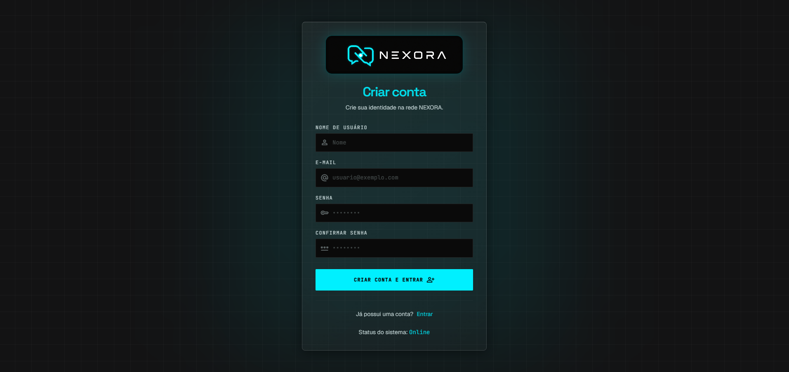
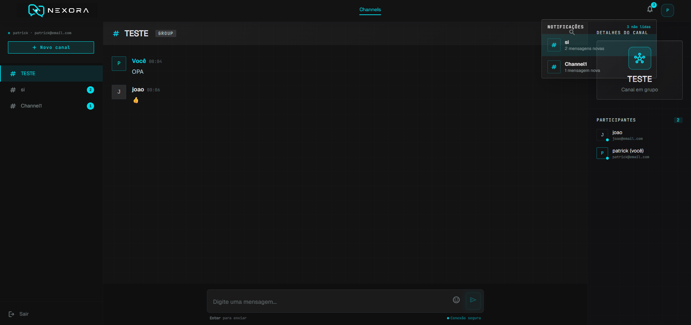
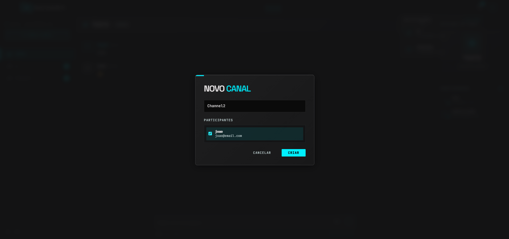
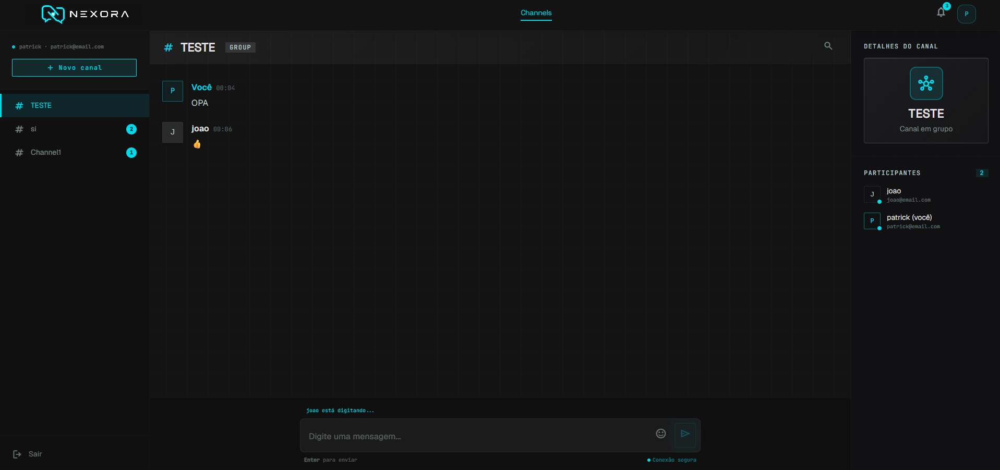

# 💬 NEXORA - Interface Web (Front-end)

> **Esta é a Interface (UI) que alimenta o sistema. [Acesse o repositório da API (Back-end) aqui]([SEU_LINK_AQUI])**

O NEXORA é um sistema de chat futurista full-stack baseado em canais e comunicação em tempo real. Este repositório contém o Front-end, desenvolvido com React, TypeScript e Vite, com foco rigoroso em componentização, responsividade e experiência do usuário (UX). A aplicação destaca-se pela sua identidade visual única: uma interface cyberpunk com glassmorphism, fundo escuro e detalhes em ciano neon.

O projeto garante alta manutenibilidade e baixo acoplamento ao separar páginas, componentes reutilizáveis, serviços de API e conexões em tempo real. A comunicação segura com a API é feita via Axios com persistência de sessão (Context API & JWT), enquanto a interatividade em tempo real é garantida através de WebSockets.

## 📸 Telas principais do Sistema

|                     Login & Cadastro                      |                     Chat & Canais                     |
|:---------------------------------------------------------:|:-----------------------------------------------------:|
|       |                |
|                    **Criação de Canal**                   |                **Notificações e Tracking**            |
| |      |

---

## 🏗️ Arquitetura, Infraestrutura e Stack

A interface foi construída focando em performance, comunicação em tempo real e em uma estrutura de código limpa e modular.

*   **React 19 & TypeScript:** Interface componentizada e fortemente tipada, garantindo fácil manutenção e previsibilidade no fluxo de dados.
*   **Vite & Vercel (DevOps):** Ambiente de desenvolvimento otimizado para build rápido e hospedagem focada em entrega contínua (CI/CD) do front-end.
*   **Tailwind CSS 4:** Design responsivo e sistema visual construído com classes utilitárias, permitindo a criação do estilo cyberpunk, glassmorphism e feedbacks visuais sem poluir a folha de estilos.
*   **STOMP.js & SockJS:** Conexão WebSocket robusta para tráfego bidirecional, viabilizando mensagens instantâneas e indicadores de digitação em tempo real, sem necessidade de *polling*.
*   **Context API & JWT:** Gerenciamento de estado global para sessão do usuário, garantindo proteção de rotas com React Router e autenticação persistida no navegador.
*   **Axios:** Cliente HTTP configurado para comunicação centralizada e padronizada com a API REST.

---

## 🚀 Domínios da Aplicação (Features)

1.  **Comunicação em Tempo Real:** Envio e recebimento de mensagens instantâneas sem recarregar a página, além de *feedback* instantâneo com indicador de digitação via WebSockets.
2.  **Gestão de Canais e Chat:** Criação de canais privados com seleção específica de participantes, histórico de conversas carregado diretamente do back-end e seletor de emojis integrado.
3.  **Busca e Notificações:** Sistema de localização de mensagens integrado dentro da conversa ativa, somado à contagem de mensagens não lidas com acesso rápido ao canal correspondente.
4.  **Autenticação e UX Responsiva:** Fluxo de Login/Cadastro integrado à API para acesso protegido. Interface imersiva (Material Symbols e tema neon) que se adapta perfeitamente tanto para desktop quanto para dispositivos móveis, exibindo validações de erro padronizadas visualmente.

---

Desenvolvido por: **Patrick Priebe**

Desenvolvedor de Software, apaixonado por código limpo, arquitetura back-end e interfaces que fogem do comum.

🔗 [LinkedIn](https://www.linkedin.com/in/patrickpriebe/) | 💻 [GitHub](https://github.com/patrickpriebe)