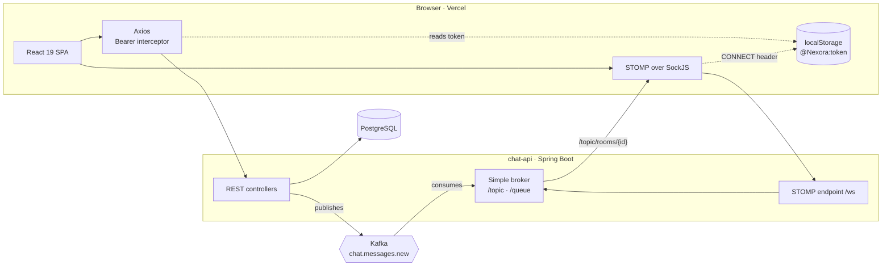

# NEXORA — Web Interface

> This repository holds the **front-end**. The API lives in
> [patrickpriebe/chat-api](https://github.com/patrickpriebe/chat-api).

A real-time chat client: React 19 in strict TypeScript, a STOMP connection kept open for
the whole session, and a dark cyberpunk interface built entirely out of design tokens.

**Live: https://nexorachat.vercel.app**

The interface rests on a single decision: **sending is HTTP, receiving is WebSocket.**
A message leaves through `POST /messages` and comes back — to the sender and to everyone
else — through a Kafka-fanned STOMP topic. Nothing on screen polls, and the same code
path renders a message whether it was typed here or three rooms away on another machine.

---

## Table of contents

- [What it does](#what-it-does)
- [Screens](#screens)
- [Architecture](#architecture)
- [Tech stack](#tech-stack)
- [The real-time model](#the-real-time-model)
- [Authentication and session](#authentication-and-session)
- [API surface consumed](#api-surface-consumed)
- [Design system](#design-system)
- [Project structure](#project-structure)
- [Running locally](#running-locally)
- [Environment variables](#environment-variables)
- [Deployment](#deployment)
- [Frontend decisions worth reading](#frontend-decisions-worth-reading)
- [Known limits](#known-limits)
- [Documentation](#documentation)

---

## What it does

A person registers or signs in, lands on the chat, creates a channel with the people they
pick, and talks. Messages appear instantly on every open client, typing indicators show
while someone writes, and channels the person is not looking at accumulate an unread
badge.

| Flow | What the user sees |
|---|---|
| Sign in / register | One screen, two modes; the API's `detail` field is what the error says |
| Channels | Every room the user belongs to, with unread counts and the open one highlighted |
| New channel | Name plus explicit member selection — a channel is never created by accident |
| Conversation | The newest page of history from the API, then live messages over STOMP, ordered by timestamp |
| Typing | An indicator that appears while the other side writes and clears after 2s of silence |
| Notifications | A dropdown listing only rooms with unread messages, each one a jump to that room |
| Search | Filters the open conversation and highlights every match inside the bubble |
| Mobile | The sidebar collapses into a native channel picker; everything else stays |

---

## Screens

| Sign in & register | Chat & channels |
|:---:|:---:|
|  |  |
| **Channel creation** | **Notifications & tracking** |
|  |  |

---

## Architecture



The browser does not treat the response to its own `POST` as the only delivery path: the
API persists the message, publishes it to Kafka, and a consumer fans it out to
`/topic/rooms/{id}`. The client subscribes to that topic for **every** room it belongs to,
not only the open one — which is what makes unread counts possible without a second
endpoint.

---

## Tech stack

| Layer | Choice | Notes |
|---|---|---|
| UI | **React 19** | Function components, hooks, `StrictMode` on |
| Language | **TypeScript** (strict flags, `verbatimModuleSyntax`) | `noUnusedLocals`, `noUnusedParameters`, `erasableSyntaxOnly` |
| Build | **Vite 8** | `tsc -b && vite build`, ES2023 target |
| Styling | **Tailwind CSS 4** + `@tailwindcss/postcss` | Token-named palette, `@config` bridge to the JS config |
| Routing | **react-router-dom 7** | Three routes, one of them guarded |
| HTTP | **Axios** | One instance, one request interceptor |
| Real time | **@stomp/stompjs 7** over **sockjs-client** | Auto-reconnect, heartbeats both ways |
| Session | **Context API** + **jwt-decode** | Token in `localStorage`, claims read client-side |
| Icons & type | **Material Symbols Outlined**, Geist, Space Grotesk, JetBrains Mono | Loaded from Google Fonts |
| Lint | **ESLint 10** flat config + `typescript-eslint` | `react-hooks` and `react-refresh` presets |
| Hosting | **Vercel** | SPA rewrite, environment variables from the panel |

There is no state library, no form library and no UI kit. The pieces that would justify
one — the session context, the channel list, the toast — are a few dozen lines each, and a
dependency for any of them would cost more attention than it saves.

---

## The real-time model

One STOMP client for the whole session, created once the room list is known:

```ts
const client = new Client({
  webSocketFactory: () => new SockJS(WS_URL),
  connectHeaders: { Authorization: `Bearer ${token}` },
  reconnectDelay: 5000,
  heartbeatIncoming: 10000,
  heartbeatOutgoing: 10000,
  onConnect: () => roomList.forEach((room) => subscribeToRoom(client, room)),
});
```

**Two subscriptions per room**, created on connect and again for any room created during
the session:

| Destination | Carries |
|---|---|
| `/topic/rooms/{id}` | Every message in that room, for every member |
| `/topic/rooms/{id}/typing` | `{ roomId, username, isTyping }`, with the username resolved by the server |

**The active room is read from a ref, not from state.** The subscription callback is
created once and would otherwise close over whichever room was open when it was
registered — every later message would be judged against a stale value. `activeRoomRef` is
updated on every change and is what the callback reads.

**A message that arrives for another room becomes an unread count**, unless the sender is
the current user: a message written on this machine must not mark itself unread on this
machine.

**Typing is throttled by silence, not by interval.** Every keystroke publishes
`isTyping: true` and resets a 2-second timer; the timer publishing `false` is the only
thing that clears the indicator. Sending a message clears it immediately, because waiting
two more seconds after the bubble already appeared reads as a bug.

**History and live traffic race, and the race is resolved by id.** Opening a room clears
the list and fetches the history, but the subscription is already live — a message can
land before the response does. The two lists are merged through a `Map` keyed by message
id and sorted by timestamp, so neither duplicates nor drops the other. `appendMessage`
applies the same id check, which is what makes appending the REST response of the user's
own `POST` safe when the STOMP copy arrives as well.

**Failures are visible.** `onStompError` raises a toast saying the connection dropped and
that reconnection is under way; `reconnectDelay` then does the reconnecting.

More: [docs/02-realtime-messaging.md](docs/02-realtime-messaging.md).

---

## Authentication and session

The API issues a JWT; the browser stores it under `@Nexora:token` and reads its claims to
know who is signed in.

- **The token is validated before it is trusted.** `readUserFromStorage` decodes it and
  discards it — removing it from storage — when `exp` has passed or when `userId`,
  `username` or `sub` is missing. A malformed token is caught and cleared instead of
  crashing the render.
- **The session is derived from the token, never from a separate stored profile.** There
  is no second copy of the user to fall out of sync.
- **One interceptor attaches the header.** No component builds an `Authorization` header
  by hand, so no request can forget it.
- **The STOMP handshake carries the same token** in the `CONNECT` frame, which the API
  validates in a channel interceptor. The typing controller then resolves the username
  from the authenticated `Principal` and ignores whatever the client sent — a client
  cannot type on someone else's behalf.
- **The route guard is a redirect, not a hidden component.** `/chat` renders only with a
  session; without one it navigates to `/`, and `/` navigates to `/chat` when a session
  exists.

Client-side decoding is for rendering only. Every authorisation decision — is this person
in this room, may they read this history — is the API's, and the API re-checks membership
on send and on history reads.

**The token lives in `localStorage`**, a deliberate trade-off for a SPA with no backend of
its own: it survives a reload, and it is readable by any script that manages to run on the
page. See [Known limits](#known-limits).

---

## API surface consumed

Base URL from `VITE_API_URL` (default `http://localhost:8080/api`).

| Method | Path | Used for |
|---|---|---|
| `POST` | `/users` | Registration |
| `GET` | `/users` | Member picker; accepts `search` and `limit`, and excludes the caller |
| `POST` | `/auth/login` | Returns `{ token }` |
| `GET` | `/rooms/me` | Channels the signed-in user belongs to |
| `POST` | `/rooms` | `{ name, type: "GROUP", memberIds }` |
| `GET` | `/messages/room/{roomId}` | The newest page of history, ascending; `before` and `limit` page backwards |
| `POST` | `/messages` | `{ content, roomId }` |

| STOMP | Destination | Direction |
|---|---|---|
| `SUBSCRIBE` | `/topic/rooms/{roomId}` | in |
| `SUBSCRIBE` | `/topic/rooms/{roomId}/typing` | in |
| `SEND` | `/app/typing` | out |

Errors are read from RFC 9457 `ProblemDetail` bodies: the API's `detail` is shown when
present, and a written fallback when it is not — never a raw status code. Sign-in and
registration are rate limited on the API and answer `429` in the same shape, so the toast
already says something useful without a change here.

Full payload shapes: [docs/04-api-contract.md](docs/04-api-contract.md).

---

## Design system

**No component writes a colour.** The palette is declared once in
[`tailwind.config.js`](chat-frontend/tailwind.config.js) under Material 3 role names —
`surface`, `on-surface-variant`, `primary-fixed-dim`, `outline-variant` — mapped to a dark
cyberpunk scheme built around a cyan accent (`#00f0ff`). A component that writes its own
hex is a component that the next palette change never reaches.

Typography is a closed set of named scales rather than free `text-*` sizes: `display-lg`,
`headline-lg`, `headline-lg-mobile`, `body-md`, `body-sm`, `label-caps`, `code-md`, each
carrying its own family, line height, letter spacing and weight. Space Grotesk for
headlines, Geist for body, JetBrains Mono for input and code-flavoured labels.

Five component classes in [`src/index.css`](chat-frontend/src/index.css) carry the whole
visual identity:

| Class | What it is |
|---|---|
| `.glass-panel` | The glassmorphism surface: gradient fill, 20px backdrop blur, lit top border |
| `.input-cyber` | Near-black field that gains a cyan border and glow on focus |
| `.btn-primary-cyber` | Solid cyan action, lifting 1px with a glow on hover |
| `.bg-grid` | The 40px background grid, at 3% white |
| `.neon-glow` / `.neon-text-glow` | The accent halo, for the active channel and headings |

Tailwind 4 reads its theme through `@config "../tailwind.config.js"`, which keeps the JS
config — and therefore the token table — as the single source while running on the v4
PostCSS pipeline.

Responsiveness is a layout swap, not a scale-down: below `md` the 288px channel sidebar is
replaced by a native `<select>` in the header, the one control that behaves correctly on
every mobile browser without any code.

More: [docs/03-design-system.md](docs/03-design-system.md).

---

## Project structure

```
chat-frontend/
├── docs/screenshots/        Interface captures used by this README
├── public/                  favicon, icon sprite
└── src/
    ├── auth/session.ts      Token storage, decoding, expiry and claim validation
    ├── components/          NexoraLogo
    ├── contexts/            AuthContext (shape + hook), AuthProvider (state)
    ├── pages/
    │   ├── Login.tsx        Sign in and register, one form in two modes
    │   └── Chat.tsx         Channels, conversation, STOMP wiring, search, emoji
    ├── services/api.ts      Axios instance, Bearer interceptor, API_URL / WS_URL
    ├── index.css            Tailwind entry, component classes, scrollbar
    └── main.tsx             Root, StrictMode, AuthProvider
```

`AuthContext` and `AuthProvider` are separate files on purpose: React Fast Refresh
invalidates a module that exports both a component and non-component values, and merging
them costs a full reload on every edit.

---

## Running locally

Requires Node 20+ and the API running (see
[chat-api](https://github.com/patrickpriebe/chat-api), which brings up PostgreSQL and
Kafka with Docker Compose).

```bash
cd chat-frontend && npm install && cp .env.example .env && npm run dev
```

The dev server serves http://localhost:5173 and talks to `http://localhost:8080/api` by
default.

| Script | What it does |
|---|---|
| `npm run dev` | Vite dev server with HMR |
| `npm run build` | Type-checks the project references, then builds to `dist/` |
| `npm run preview` | Serves the production build locally |
| `npm run lint` | ESLint over the whole project |

`npm run build` fails on a type error before Vite is ever invoked — the build *is* the type
check, so a broken type cannot reach a deploy.

---

## Environment variables

| Variable | Default | Meaning |
|---|---|---|
| `VITE_API_URL` | `http://localhost:8080/api` | REST base URL |
| `VITE_WS_URL` | derived from `VITE_API_URL` | SockJS endpoint |

When `VITE_WS_URL` is absent it is derived by stripping a trailing `/api` and appending
`/ws`, so a correct API URL alone is enough for the standard deployment. Set it explicitly
when the WebSocket endpoint is not a sibling of the REST base.

Both are compiled into the bundle at build time — `VITE_`-prefixed variables are public by
definition. Nothing secret belongs in either.

---

## Deployment

**Vercel**, configured by [`vercel.json`](chat-frontend/vercel.json):

```json
{ "rewrites": [{ "source": "/:path*", "destination": "/index.html" }] }
```

Without that rewrite, a hard refresh on `/chat` asks the CDN for a file that does not
exist and gets a `404`; the router only ever sees a URL the server already agreed to
serve. The environment variables are set in the Vercel project, not in the repository.

The API must allow the deployed origin: `app.cors.allowed-origin-patterns` on the back end
covers both the REST layer and the SockJS handshake.

---

## Frontend decisions worth reading

**`window.global = window` in `index.html`.** `sockjs-client` is a pre-bundler-era library
that expects Node's `global`. Without the shim the app builds fine and dies at runtime on
the first connection attempt. It is three words in the HTML instead of a bundler plugin
because the shim has to exist before any module evaluates.

**Sending is REST, receiving is STOMP.** Publishing the message over the socket would be
one hop shorter and would put persistence, the room-membership check and the Kafka publish
behind a channel with no status codes. The `POST` gives an unambiguous failure — and on
failure the typed text is put back into the input rather than lost.

**The input clears optimistically, the message does not appear optimistically.** The field
empties immediately so typing can continue; the bubble appears when the server has accepted
it. A message on screen means a message that exists.

**Search escapes its own query before building a `RegExp`.** Highlighting splits the
content on the query — and a user typing `c++` or `(` would otherwise throw inside a
render. `escapeRegExp` is not defensive decoration; it is the difference between a filter
and a crash.

**The emoji picker preserves the caret.** It inserts at `selectionStart`/`selectionEnd`
instead of appending, then restores focus and the cursor inside `requestAnimationFrame` —
after React has committed the new value, which is the only moment the position survives.

**Toasts announce themselves correctly.** Errors render with `role="alert"` and successes
with `role="status"`, because an interruption and a confirmation are not the same event for
a screen reader.

**Effect cleanup deactivates the client and clears both timers.** A `cancelled` flag also
guards the initial fetch, so a `StrictMode` double-mount in development cannot leave a
second STOMP connection subscribed to every room.

---

## Known limits

Recorded so they do not look like oversights.

- **The token is in `localStorage`.** It survives a reload and is readable by any injected
  script. The right fix is an `HttpOnly` cookie, which needs the API to set it and a CSRF
  strategy to go with it; the interim mitigation — a Content-Security-Policy on the
  deployed site — is not in place yet.
- **There are no automated tests and no CI.** Nothing but `tsc` and ESLint guards a change
  today.
- **Search only covers what is loaded.** It filters the messages already in memory for the
  open room; there is no search endpoint and no search across channels.
- **Unread counts are per session.** They live in component state and reset on reload,
  because the API exposes no read state — which is also why the `SENT | DELIVERED | READ`
  status arriving on every message is currently unused by the interface.
- **Only group channels can be created.** The `DIRECT` room type is modelled end to end and
  rendered with its own icon, but no screen creates one.
- **The presence dot is decorative.** Every member in the channel details panel carries a
  lit indicator; there is no presence channel behind it, so it says "member", not "online".
- **Only the newest page of a conversation is reachable.** The API now paginates the
  history and returns the most recent 50 messages by default; the client sends no `before`
  cursor and has no "load older" affordance, so anything past that page cannot be reached
  from the interface. The API side of this is done — the reverse-infinite scrolling and
  the scroll anchoring are not, and that is the harder half.
- **Nothing is virtualised.** Whatever page is loaded is rendered in full.
- **Interface copy is Portuguese.** Documentation and identifiers are English; the strings
  the user reads are not, and there is no i18n layer to make that a choice.

---

## Documentation

- [Architecture](docs/01-architecture.md) — how the SPA, the API and Kafka fit together
- [Real-time messaging](docs/02-realtime-messaging.md) — the STOMP lifecycle, in detail
- [Design system](docs/03-design-system.md) — tokens, typography, component classes
- [API contract](docs/04-api-contract.md) — every request and payload the client uses
- [Roadmap](docs/05-roadmap.md) — what is missing, and what stays out

> Documentation and identifiers are in English. The interface strings and a few code
> comments are in Portuguese, which is how the codebase reads today.

---

Built by **Patrick Priebe** — software developer, focused on clean code, back-end
architecture and interfaces that do not look like everyone else's.

[LinkedIn](https://www.linkedin.com/in/patrickpriebe/) · [GitHub](https://github.com/patrickpriebe)
