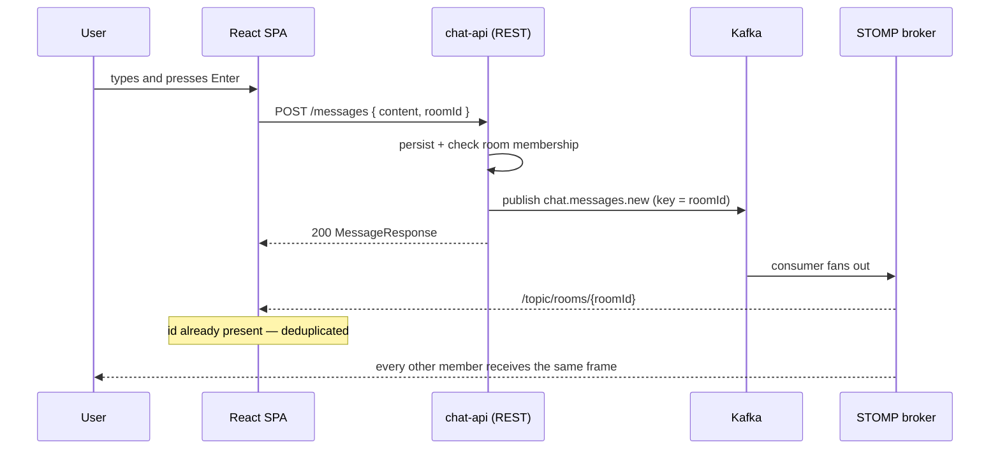
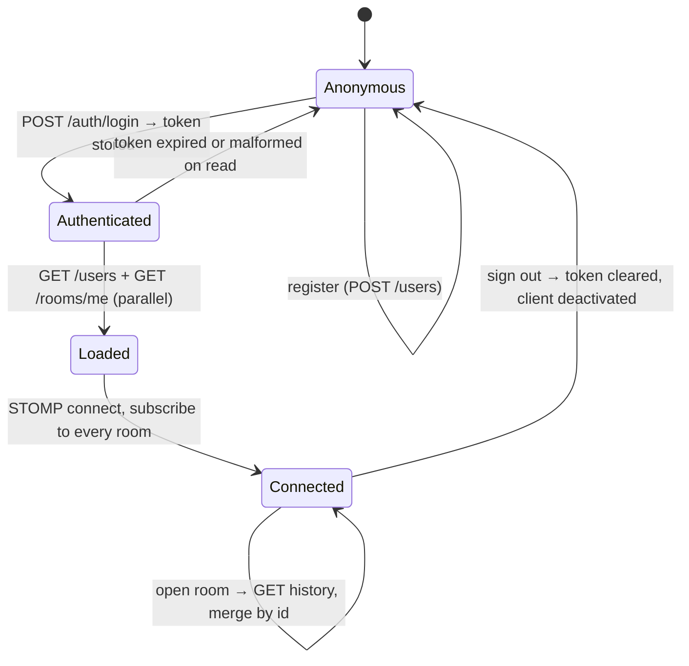

# Architecture

How the SPA is put together, and where it sits relative to the API.

- [The two halves of the system](#the-two-halves-of-the-system)
- [Why sending and receiving take different paths](#why-sending-and-receiving-take-different-paths)
- [Layers inside the SPA](#layers-inside-the-spa)
- [Screen composition](#screen-composition)
- [State ownership](#state-ownership)
- [Lifecycle of a session](#lifecycle-of-a-session)
- [Failure handling](#failure-handling)

---

## The two halves of the system

NEXORA is two repositories:

| Repository | Contents |
|---|---|
| [chat-ui](https://github.com/patrickpriebe/chat-ui) (this one) | React SPA, deployed to Vercel |
| [chat-api](https://github.com/patrickpriebe/chat-api) | Spring Boot API, PostgreSQL, Kafka, STOMP broker |

The SPA is a static bundle. It has no server of its own, no API routes and no
server-side rendering — which is why every runtime address it needs is a build-time
environment variable, and why the session token has nowhere to live except the browser.



The sender gets the message twice: once as the HTTP response, once over the socket. Both
paths converge on `appendMessage`, which drops anything whose id is already in the list.
Deduplication by id is not an optimisation here — it is what allows the two paths to exist
at once.

---

## Why sending and receiving take different paths

Publishing the message over the socket instead would be one hop shorter. It was not done,
for three reasons:

1. **A `SEND` frame has no response.** Persistence, the room-membership check and the
   Kafka publish all happen server-side and can all fail. Over STOMP the client learns
   about that failure — if at all — as an error frame with no correlation to the message
   that caused it.
2. **The failure has to reach the user.** When the `POST` fails the typed content is put
   back into the input and a toast explains why. Losing what someone wrote is the one
   unacceptable outcome in a chat client.
3. **Kafka is what makes the fan-out correct**, and it is the API's business. Making the
   browser publish would still not remove the broker from the path; it would only remove
   the status code.

The socket keeps the job it is uniquely good at: pushing what the client could not have
asked for, because it does not know it exists yet.

---

## Layers inside the SPA

```
main.tsx            mounts, wraps everything in AuthProvider
  App.tsx           router + route guard
    Login.tsx       unauthenticated screen
    Chat.tsx        authenticated screen

auth/session.ts     token: read, validate, store, clear
contexts/           session state and the useAuth hook
services/api.ts     the single axios instance and the two URLs
```

The dependency direction is one-way: pages depend on services and contexts, services
depend on `auth/session` for the storage key, and nothing depends on a page. There is no
module a page could import that would import a page back.

`services/api.ts` is the only module that knows the API's address, and the only one that
knows how a request is authorised:

```ts
api.interceptors.request.use((config) => {
  const token = localStorage.getItem(TOKEN_KEY);
  if (token && config.headers) config.headers.Authorization = `Bearer ${token}`;
  return config;
});
```

A component that needed to build that header by hand would be a component that could
forget it.

---

## Screen composition

`Chat.tsx` renders three columns, each appearing at its own breakpoint:

| Column | Width | Visible from | Contents |
|---|---|---|---|
| Channels | 288px | `md` | Channel list, unread badges, new-channel button, sign out |
| Conversation | fluid | always | Header, message list, typing line, composer |
| Channel details | 288px | `lg` | Channel identity, member list with initials |

Below `md` the channel column is replaced by a native `<select>` in the header. A custom
dropdown would have to reimplement what a mobile browser already does natively and
accessibly, and it would do it worse.

Overlaying all of this: the new-channel modal, the notifications dropdown, the emoji
picker and the toast. Each is conditional markup inside the same component rather than a
portal — nothing about the layout requires escaping the stacking context.

---

## State ownership

| State | Owner | Why there |
|---|---|---|
| Session (`user`, `signed`) | `AuthProvider` | Two screens need it; the router reads it to route |
| Rooms, messages, unread, typing | `Chat` | Nothing outside the chat screen reads them |
| Draft, pickers, modal, search | `Chat` | Pure UI, dies with the screen |
| Active room (for callbacks) | `activeRoomRef` | Read inside a long-lived subscription callback |
| Token | `localStorage` | Must survive a reload; `AuthProvider` seeds itself from it |

There is no store and no reducer. The one place where plain state was not enough — the
subscription callback needing the *current* active room instead of the one captured at
subscription time — is solved with a ref that mirrors the state, which is what a ref is
for.

---

## Lifecycle of a session



The two initial requests run through `Promise.all`: the member picker and the channel
list are independent, and serialising them would make the first paint wait for no reason.

The socket is opened **after** the room list arrives, because the subscription set is
derived from it. A room created later is subscribed at creation time, so a channel is live
the moment it exists rather than after the next reload.

---

## Failure handling

| Failure | What happens |
|---|---|
| Initial load fails | Toast asking for a refresh; the screen stays empty rather than half-wired |
| History fetch fails | Toast; live messages for that room still arrive |
| Send fails | Content restored to the input, toast with the API's `detail` |
| Channel creation fails | Inline error inside the modal, next to the fields, not a toast |
| STOMP error frame | Toast saying the connection dropped; `reconnectDelay` retries every 5s |
| Token expired | Cleared on the next read; the guard redirects to the login screen |

The split between toast and inline error is deliberate: a failure that belongs to a form
the user is looking at is shown in that form, and a failure of something happening in the
background is shown where the user's attention is not.
